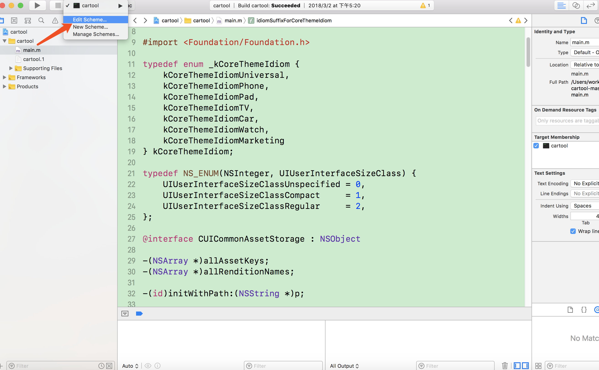
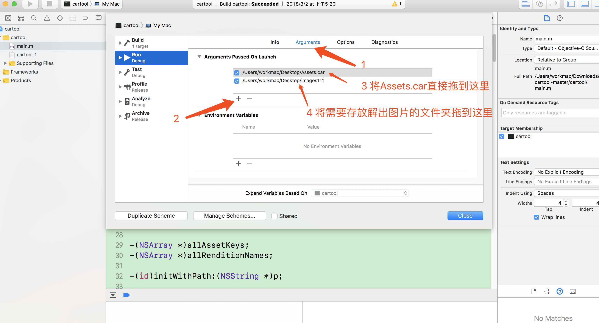
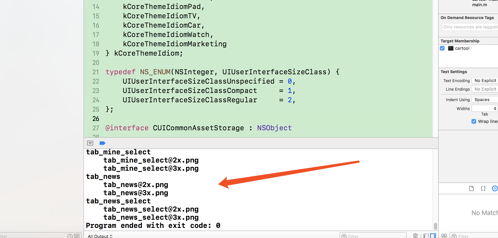
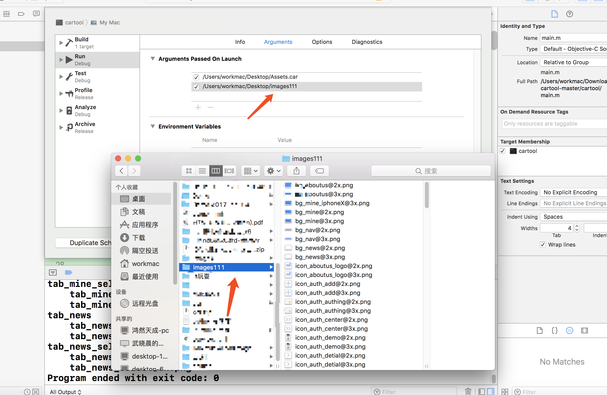

# cartool--xcode11-
cartool-修复xcode11错误

使用如下：

打开cartool.xcodeproj文件，在打开的xcode项目中进入Edit Scheme

之后按照下图中的操作顺序进行：

注意点：Assets.car文件路径和存储图片的文件夹的文件路径顺序是固定的，Assets.car在第一个，文件夹在第二个，文件夹可以自己创建一个空的。如果写反就出错了，切记切记！

然后关闭Edit Scheme，运行程序，稍等一会就会发现解出的图片名称被打印出来，然后去刚才设置的存储解出图片的文件夹查看。

